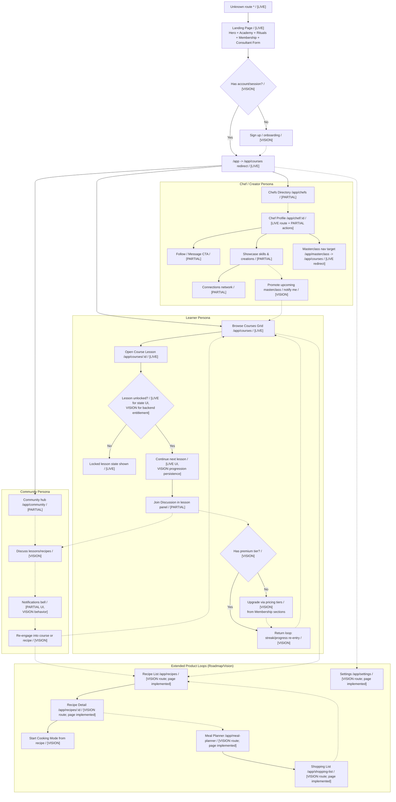

# CookFlow User Flows

Full product vision user flow diagram, grounded in current routing/navigation and extended with design-intent flows.

## Status Conventions

- `[LIVE]`: Reachable via current route/link behavior.
- `[PARTIAL]`: Reachable page exists but key actions are placeholder or limited.
- `[VISION]`: Implemented UI not currently routed, or conceptual design flow.
- `-.->`: Conceptual/unwired transition.

## Persona-Based Flow Diagram

## Companion Flow Matrix

| Persona | Entry | Trigger | Transition | Outcome | Status | Code Reference |
| --- | --- | --- | --- | --- | --- | --- |
| Shared | `/` | App load | Landing sections render | Acquisition funnel starts | LIVE | `/Users/wysmyfree/Projects/cookflow/App.tsx`, `/Users/wysmyfree/Projects/cookflow/components/Hero.tsx` |
| Shared | `/app` | Navigate to app shell | Redirect to `/app/courses` | Course catalog becomes default home | LIVE | `/Users/wysmyfree/Projects/cookflow/App.tsx` |
| Shared | `/app/masterclass` | Nav click in dashboard | Redirect to `/app/courses` | Masterclass currently maps to courses | LIVE | `/Users/wysmyfree/Projects/cookflow/App.tsx`, `/Users/wysmyfree/Projects/cookflow/pages/DashboardLayout.tsx` |
| Learner | `/app/courses` | Click course card | `/app/courses/:id` | Enter lesson/cooking mode | LIVE | `/Users/wysmyfree/Projects/cookflow/pages/Dashboard.tsx`, `/Users/wysmyfree/Projects/cookflow/pages/CookingMode.tsx` |
| Learner | Lesson page | Read syllabus status | Completed/In progress/Locked states | Progress gating shown in UI | LIVE | `/Users/wysmyfree/Projects/cookflow/pages/CookingMode.tsx` |
| Learner | Lesson page | Click discussion/community cues | Community participation intent | Engagement loop begins | PARTIAL | `/Users/wysmyfree/Projects/cookflow/pages/CookingMode.tsx`, `/Users/wysmyfree/Projects/cookflow/pages/Community.tsx` |
| Learner | Landing membership sections | Click tier CTA | Checkout/subscription journey | Monetization/upgrade | VISION | `/Users/wysmyfree/Projects/cookflow/components/Membership.tsx`, `/Users/wysmyfree/Projects/cookflow/pages/Dashboard.tsx` |
| Chef/Creator | `/app/chefs` | Discover chefs | Open profile detail | Chef-specific engagement | PARTIAL | `/Users/wysmyfree/Projects/cookflow/pages/ChefList.tsx`, `/Users/wysmyfree/Projects/cookflow/pages/ChefProfile.tsx` |
| Chef/Creator | `/app/chef/:id` | Follow/Message/Recipe CTA | Relationship actions | Network and creator engagement | PARTIAL | `/Users/wysmyfree/Projects/cookflow/pages/ChefProfile.tsx` |
| Community | `/app/community` | Open community tab | Enter community space | Placeholder hub currently | PARTIAL | `/Users/wysmyfree/Projects/cookflow/pages/Community.tsx` |
| Community | Lesson discussion | Reply/notify loops | Notification -> return to learning | Retention re-entry loop | VISION | `/Users/wysmyfree/Projects/cookflow/pages/CookingMode.tsx`, `/Users/wysmyfree/Projects/cookflow/pages/DashboardLayout.tsx` |
| Extended | Recipe list page | Search/filter/select recipe | Recipe detail deep dive | Recipe discovery flow | VISION | `/Users/wysmyfree/Projects/cookflow/pages/RecipeList.tsx`, `/Users/wysmyfree/Projects/cookflow/pages/RecipeDetail.tsx` |
| Extended | Recipe detail | Start cooking/add to plan | Cooking mode or planner branch | Practical cooking workflow | VISION | `/Users/wysmyfree/Projects/cookflow/pages/RecipeDetail.tsx`, `/Users/wysmyfree/Projects/cookflow/pages/MealPlanner.tsx` |
| Extended | Meal planner | Drag recipes to slots | Build weekly plan | Plan-to-shop continuity | VISION | `/Users/wysmyfree/Projects/cookflow/pages/MealPlanner.tsx` |
| Extended | Shopping list | Check/clear items | Grocery completion | Retention into next planning cycle | VISION | `/Users/wysmyfree/Projects/cookflow/pages/ShoppingList.tsx` |
| Extended | Settings | Open account/preferences | Manage app/user options | Personalization/account control | VISION | `/Users/wysmyfree/Projects/cookflow/pages/Settings.tsx` |
| Shared | `*` | Invalid URL | Redirect to `/` | Funnel recovers to landing | LIVE | `/Users/wysmyfree/Projects/cookflow/App.tsx` |

## Validation Checklist

- Every route in `/Users/wysmyfree/Projects/cookflow/App.tsx` appears in the diagram.
- `/app/masterclass -> /app/courses` redirect is represented.
- Major design CTAs are mapped to destination or marked conceptual/unwired.
- No `LIVE` node depends on non-existent routing.
- Diagram includes both monetization path and retention loops.
